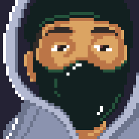

<h3 align="center"> -- Olá! Sou Alexsandro Duarte -- 😃<h3>

  

  <!--
 

 -->

## Sobre mim

- 🙋‍♂️ Unity/C# Developer | Desenvolvedor Front-End | Game Developer | Desenvolvedor Back-End.
- 📚 Tecnólogo em Jogos Digitais | Especialista em Desenvolvimento de Jogos.
- 🚩 Aprender mais a cada dia.
- 🧩 Hobbys: Assistir Futebol | Ver Filmes | Jogar Video Game 🧐

## Me Contate

 

## Tecnologias 
### Game Developer/Design
 </img>
 </img>
### Front-End
</img>
</img> 
</img>
 </img>
 </img>

### Back-end
</img>
</img>

### Banco de Dados
</img>
</img>
